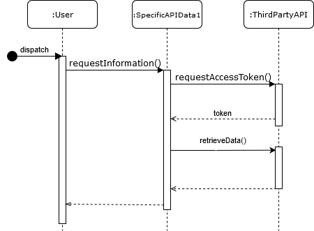
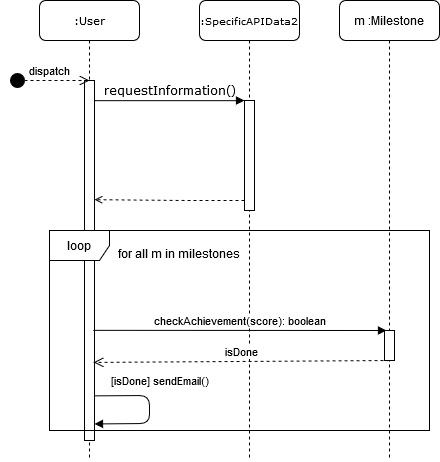

# Üzleti igények

## Szöveges leírás

A cél egy olyan alkalmazás, mely különböző online játékok statisztikáit összegyűjti, és egy helyen kimutatja. A felhasználók regisztráció után összeköthetik a profiljukat a különböző játékokkal, és ezen adataikat egy helyről elérhetik. Lehetőség lesz az adatok grafikus kimutatására, illetve más, az oldalon regisztrált felhasználók keresésére is, statisztikáik megtekintésére, ha ők ezt a profiljukon engedélyezték. Lehetséges lesz két felhasználó adatait is összehasonlítani, ebből esetleges következtetéseket levonni. Az alkalmazás napi szinten lekéri a regisztrált felhasználók adatait, majd ezeket eltárolja, hogy visszamenőlegesen is meg lehessen nézni egy felhasználó adatait, fejlődését. Lehetséges lesz beállítani, hogy a napi frissítésnél ha az alkalmazás valamilyen mérföldkő elérését érzékeli, az email-t küldjön a felhasználónak, mely tartalmazza az elért teljesítményt. Fel lehet majd iratkozni mások teljesítményeire is, hogy a felhasználó személyben gratulálhasson a mérföldkőt elérő felhasználónak.
A felhasználók publikusan elérhető adatai alatt lesz egy kommentszekció is, melyben lehet egymás, vagy saját teljesítményeinkhez megjegyzést fűzni.

## Követelmény lista

| ID | Fontosság | Megjegyzés |
| --- | -------- | -----------|
|1|magas|Az alkalmazás különböző API hívások segítségével statisztikákat gyűjt be a felhasználóról, melyeket megmutat neki|
|2|magas|Több API-ból származó adatokat tud megtekinteni a felhasználó|
|3|magas|A felhasználó tud regisztrálni, regisztráció után pedig belépni|
|4|magas|A felhasználó hozzá tudja kötni az account-ját egy másik, third-party szolgáltatásban lévő accoutjával|
|5|normál|A felhasználó az adatait grafikusan megtekintheti|
|6|alacsony|Az alkalmazás előrevetíti, hogy a felhasználó adatai alapján milyen teljesítmény valószínű tőle a jövőben|
|7|magas|A felhasználó fog tudni más regisztrált felhasználókra keresni, azok profilját esetlegesen megtekinteni|
|8|magas|A felhasználó beállíthatja, hogy mások láthatják-e az ő statisztikáit
|9|normál|A felhasználó képes lesz összehasonlítani az adatait más regisztrált felhasználókkal|
|10|alacsony|Az alkalmazás az összehasonlításokból képes lesz szöveges következtetéseket levonni|
|11|magas|Az alkalmazás - lehetőség esetén - minden nap egy adott időpontban lekéri a felhasználó adatait az API-tól, és eltárolja az adatait|
|12|magas|A lekérési időpont felhasználónként és API-onként változó lesz, a túlterhelés elkerülése érdekében|
|13|normál|Az alkalmazás email értesítőt küld a felhasználónak bizonyos mérföldkövek elérésekor|
|14|alacsony|A felhasználó feliratkozhat mások mérföldköveire is, hogy értesítést kapjon az ő teljesítményeiről|
|15|normál|A felhasználók adatai alatt lesz egy kommentszekció, melybe lehetséges lesz majd megjegyzéseket fűzni|

# Tervek

## Entitások

* Felhasználó
* API-ok
* Mérföldkő
* Kommentszekció
* Komment

## Use-case diagram

## Osztálydiagram

## Szekvenciadiagramok

